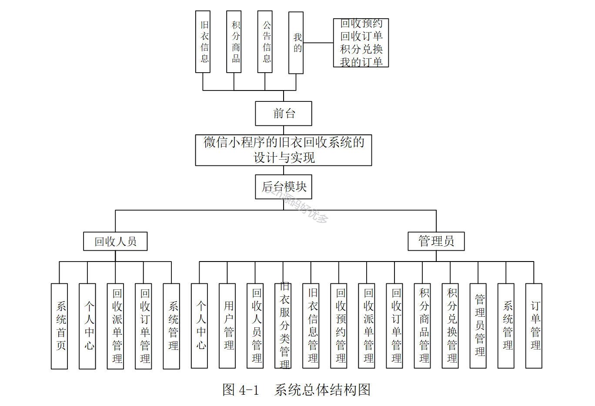
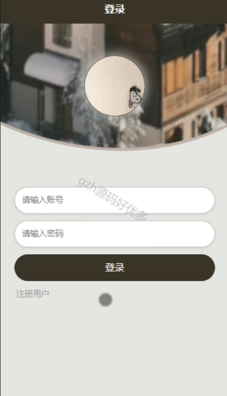
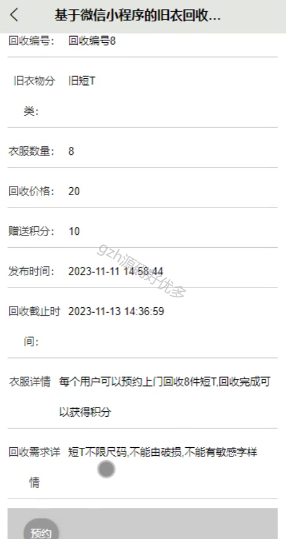
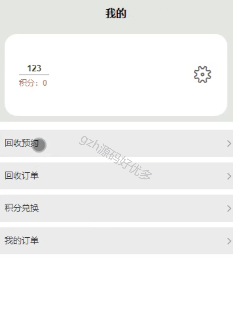
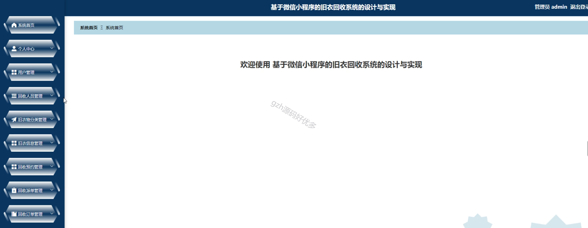
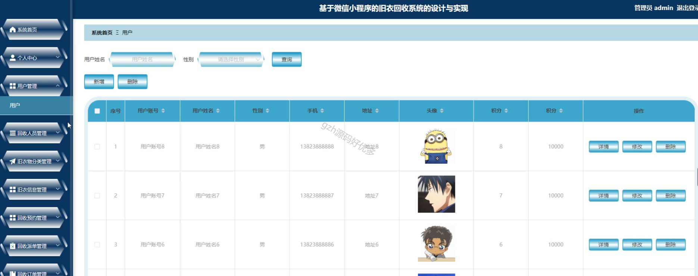
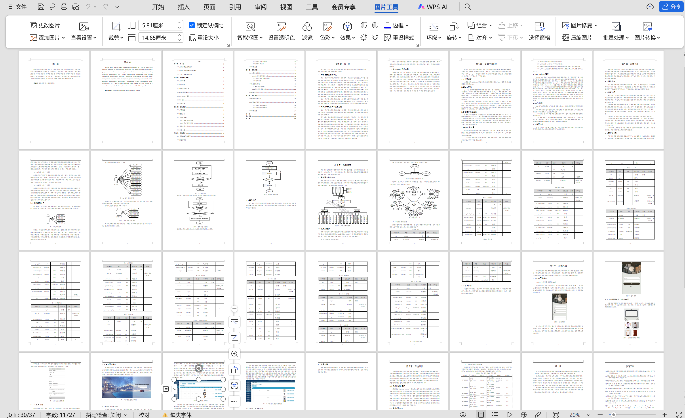

# mpweixinA068
mpweixinA068空巢老人健康管理微信小程序LW
 
## 查看主页获取源码

### 一、作品包含

源码+数据库+设计文档万字+全套环境和工具资源+部署教程

### 二、项目技术

前端技术：Html、Css、Js、Vue2.0、Element-ui、Uniapp

数据库：MySQL

后端技术：Java、Spring Boot、MyBatis

  

### 三、运行环境

开发工具：IDEA/eclipse + HBuilderX + 微信开发者工具

数据库：MySQL5.7（最低要5.7版本）

数据库管理工具：Navicat10以上版本

环境配置软件： JDK1.8+Maven3.6.3

前端Nodejs：14

### 四、项目介绍
项目编号：mpweixinA068

随着社会老龄化程度不断加深，空巢老人的健康管理成为一个日益重要的问题。为了更好地关注和管理空巢老人的健康状况，本文利用Spring Boot框架和MySQL数据库，结合微信小程序等技术，设计并实现了一套基于微信小程序的空巢老人健康管理系统。

该系统包括社区工作人员、社区管理人员、健康文章、健康视频、健康咨询、咨询回复、医生预约、健康监测、检查报告等功能模块。社区工作人员可以通过系统对空巢老人进行健康管理和关怀，及时了解他们的健康状况，并提供健康咨询和指导。空巢老人可以通过系统获取健康文章、观看健康视频，进行健康监测，并与医生预约诊疗等。

### 五、运行截图

  
